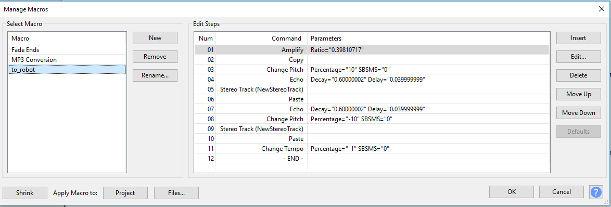

# Roborock S55 Voicepack

### This is a project, deticated to creating custom voice packs for roborock s50 and s55

### Feel free to add more voices

### voice commands are provided [in here](https://kaeni.de/deutsche-sprachpakete-fuer-den-roborock-sweep-one/)

## Steps to install custom voice
* Find your IP
    * Ip can be found in `Mi home app`: 
      * Tap `three dots` on top right corner
      * `General Settings` -> `Network Information` 
      
* Find your token 
  * This can be done using `Mi home 5.4.38 modifie.apk` provided inside repository
  * Install app, and go to same location where `IP` is provided, token will be shown there
  * *Alternative ways how to get the token can be found [here](https://github.com/Maxmudjon/com.xiaomi-miio/blob/master/docs/obtain_token.md)*
  
* Paste `IP` and `token` inside `Mirobo v1.1.0 inkl. Sprachpakete v5\win-mirobo.ini`
* Launch `Mirobo v1.1.0 inkl. Sprachpakete v5\win-mirobo.bat`
* Type `2` and press `ENTER`
* Input your voicepack ant press `ENTER`
* Wait a bit and it will be finished

## How to make voicepack
* All you have to do is create separate audio files in `.waw` file format and paste them into one folder. All available commands you can find [in here](https://kaeni.de/deutsche-sprachpakete-fuer-den-roborock-sweep-one/)
* All audiofiles has to be in `mono`
* Other voicepacks:
  * [Original](https://vacuumz.info/download/voice/)
  * [Alternative](https://therealmoeder.github.io/rockrobo.html)

## How to make robot voice
* For that I used [Audacity](https://www.audacityteam.org/)
* Script that was used to transform voice to robot sounding

